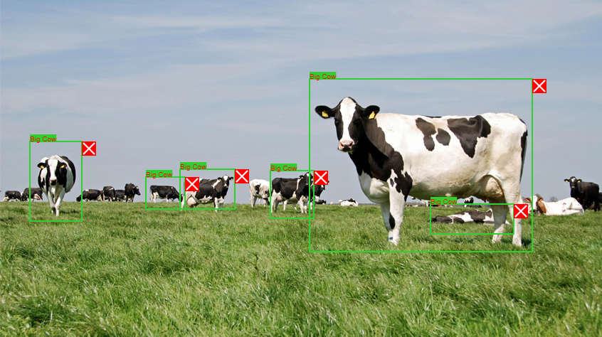

# Web-Image-Annotation-to-REST-API-Format-V1-rectangle-shape-
You can annotate your image using this website (REST API Format). Just upload your image file and annotate everything what do you want. :D

This code doesn't include the back-end. You can add your favorite back-end framework to complete everything.

How to use it?

1. First, upload your image.
2. Add your annotation by click & drag it on your uploaded image.
3. You can see your annotation with REST API Format by clicking the "Export Annotations" button.

Example:

Use this to create Machine Learning dataset. (YOLO, R-CNN, etc)
